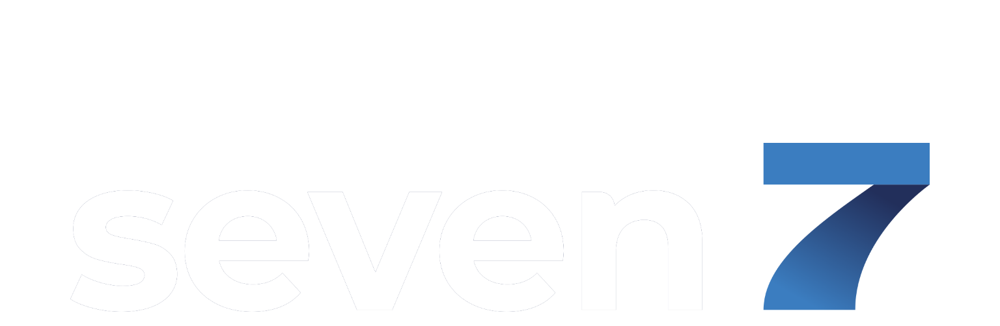
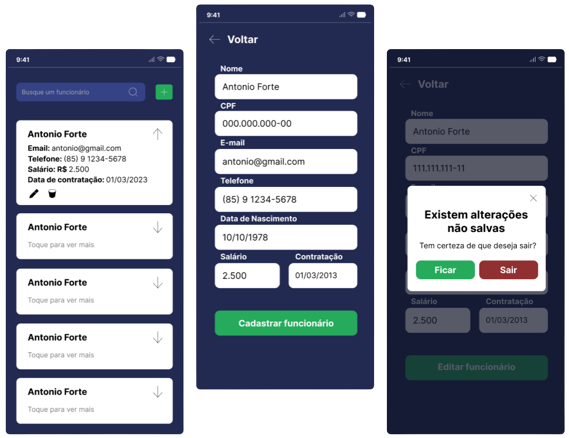

<br />
<p align="center">
  <a href="https://www.gruposeven.app">
    
  </a>
  <h2 align="center">
    <strong>
      Desafio Grupo Seven
    </strong>
  </h2>

  <p align="center">
    Esse projeto tem como objetivo de implementar o teste prático para o processo seletivo da Grupo Seven em <a href="https://reactnative.dev">React Native</a> e utilizando <a href="https://expo.dev">Expo</a>.
  </p>
</p>

<a href="https://www.figma.com/file/QIB3ThH53E0RGivOj0qyVs/Desafio-Grupo-Seven">
    <p align="center"></p>
</a>

---

<details open="open">
  <summary>
    <strong>
      Índice
    </strong>
  </summary>
  <ol>
    <li>
      <a href="#-sobre-o-projeto">Sobre o projeto</a>
      <ul>
        <li><a href="#-frameworks">Frameworks</a></li>
      </ul>
    </li>
    <li><a href="#-instalação">Instalação</a></li>
  </ol>
</details>

---

# 💭 **Sobre o projeto**
Foi desenvolvido um app em React Native para administrar os funcionários de uma empresa. O apicativo contém as seguintes funcionalidades implementadas:
- Listagem de funcionários, contendo nome, e-mail, telefone, salário e data da contratação;
- Tela com a exibição dos detalhes de um funcionário;
- Formulário para a criação de um novo funcionário;
- Formulário para a edição dos dados de um funcionário;
- Botão para remoção de um funcionário.

A interface pensada e implementada foi adicionada ao Figma para uma melhor visualização, podendo ser acessada clicando [aqui](https://www.figma.com/file/QIB3ThH53E0RGivOj0qyVs/Desafio-Grupo-Seven).

---

## ✨ **Frameworks**

- <a href="https://reactnative.dev"></a>

- <a href="https://expo.dev"></a>

- <a href="https://styled-components.com"></a>

- <a href="https://www.typescriptlang.org"></a>

- <a href="https://yarnpkg.com"></a>

- <a href="https://git-scm.com"></a>

- <a href="https://github.com"></a>

---

# 📲 **Instalação**

- Clonar o repositório com o comando
  ```sh
  git clone https://github.com/LinsThi/Seven-INC.git
  ```

- É preciso ter um gerenciador de pacotes instalado na máquina, como por exemplo `yarn` ou `npm`.
<br/><br/>
- Para instalar todas as dependências utilizadas no projeto, basta executar o comando `yarn` ou `npm install`.
<br/><br/>
- A aplicação pode ser iniciada com `npx expo start`.
<br/><br/>
- É possível rodar a aplicação no próprio celular ou em um emulador. 
    - Rodar no celular: Instale o aplicativo [Expo Go](https://expo.dev/client) e leia o QR Code que aparecerá no terminal quando for executado o último comando. Caso não apareça o QR Code, é possível conectar o celular na máquina com um cabo USB e apertar a letra `a` no mesmo terminal.
    
    - Rodar no emulador: Com um emulador instalado na máquina, no mesmo terminal em que foi executado o último comando, é preciso apertar a letra `a`.
---